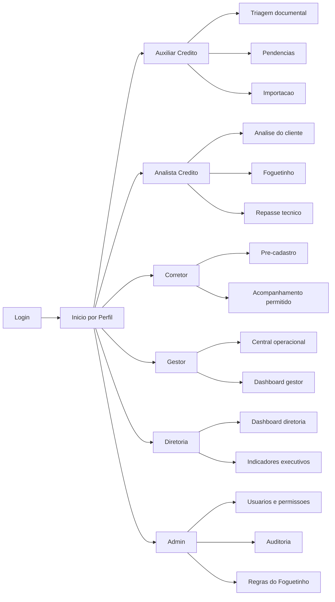

# Mapa de Telas e Perfis - MAQ2-Credito

## 1. Objetivo

Estruturar o MAQ2-Credito como aplicativo corporativo por perfil de usuario, com telas claras, permissioes objetivas e fluxos de trabalho separados por responsabilidade.

Perfis definidos:

- Auxiliar Credito
- Analista Credito
- Corretor
- Gestor
- Diretoria
- Admin

## 2. Principio de Navegacao

Cada perfil deve entrar no sistema e ver primeiro aquilo que precisa resolver.

O MAQ2-Credito nao deve funcionar como um menu grande de telas soltas. Ele deve funcionar como uma mesa de trabalho por perfil:

- operador ve fila e proxima acao;
- analista ve decisao e regras;
- corretor ve pre-cadastro e acompanhamento permitido;
- gestor ve gargalos e produtividade;
- diretoria ve indicadores consolidados;
- admin ve configuracao, seguranca e auditoria.

## 3. Mapa Geral

## 4. Perfil: Auxiliar Credito

### Objetivo

Apoiar a operacao de credito em tarefas repetitivas, triagem inicial, conferencia documental simples e organizacao de pendencias.

### Tela inicial

**Fila Auxiliar**

Deve mostrar:

- processos novos;
- documentos aguardando triagem;
- pendencias sem responsavel;
- processos com dados incompletos;
- lotes importados que precisam revisao;
- tarefas do dia.

### Telas do perfil

| Tela | Finalidade |
| --- | --- |
| Inicio | Prioridades do dia e avisos |
| Fila Auxiliar | Lista de processos para triagem |
| Conferencia Documental | Validacao basica de documentos |
| Pendencias | Pendencias abertas e retorno recebido |
| Importacao | Upload, preview e validacao de planilhas |
| Consulta de Processo | Visualizacao operacional sem decisao final |

### Permissoes

Pode:

- visualizar processos atribuidos;
- atualizar status documental basico;
- registrar observacoes operacionais;
- sinalizar pendencias;
- corrigir dados simples antes da analise.

Nao pode:

- aprovar credito;
- liberar assinatura;
- alterar regras do Foguetinho;
- acessar configuracoes administrativas;
- excluir processos.

### Indicadores

- Pendencias tratadas.
- Documentos conferidos.
- Erros por lote importado.
- Tempo medio ate enviar para analista.

## 5. Perfil: Analista Credito

### Objetivo

Tomar decisoes operacionais de credito, validar regras, interpretar documentos e conduzir o processo ate a etapa tecnica correta.

### Tela inicial

**Mesa do Analista**

Deve mostrar:

- processos em analise;
- bloqueios do Foguetinho;
- documentos criticos;
- casos prontos para avancar;
- casos travados por Agehab, CCA, sinal ou fiador.

### Telas do perfil

| Tela | Finalidade |
| --- | --- |
| Inicio | Prioridades do analista |
| Central de Credito | Fila principal por etapa e risco |
| Analise do Cliente | Dados, documentos, status e decisao |
| Dossie Documental | Checklist completo e motivos |
| Foguetinho | Regras disparadas e sugestoes |
| Repasse Tecnico | Condicoes para assinatura |
| Historico | Eventos e auditoria do processo |

### Permissoes

Pode:

- analisar documentos;
- registrar parecer;
- responder pendencias;
- aprovar ou reprovar checklist operacional;
- acionar Foguetinho;
- enviar processo para proxima etapa;
- registrar feedback sobre regra.

Nao pode:

- alterar configuracoes globais;
- editar usuario;
- mudar regra ativa sem autorizacao;
- apagar historico.

### Indicadores

- Processos analisados.
- Tempo medio em analise.
- Reprovacoes por motivo.
- Bloqueios por tipo.
- Concordancia com Foguetinho.

## 6. Perfil: Corretor

### Objetivo

Permitir entrada controlada de dados, pre-cadastro e acompanhamento restrito do andamento dos clientes vinculados ao corretor.

### Tela inicial

**Portal do Corretor**

Deve mostrar:

- agenda no topo;
- tarefa que precisa fazer agora;
- tarefas urgentes;
- tarefas urgentes, mas nao criticas;
- tarefas que nao pode finalizar o dia sem cumprir;
- tarefas semanais;
- pendencias documentais com cliente, documento pendente e prazo;
- clientes cadastrados pelo corretor;
- status permitido;
- pendencias solicitadas;
- retorno da analise;
- atalho para novo pre-cadastro.

Ordem corporativa da tela:

1. Agenda.
2. Prioridades do dia.
3. Pendencias documentais.
4. Filtros.
5. Lista de clientes na mesma ordem operacional da tela do analista.

### Telas do perfil

| Tela | Finalidade |
| --- | --- |
| Inicio | Resumo de clientes e pendencias |
| Pre-cadastro | Cadastro inicial de cliente |
| Meus Clientes | Acompanhamento limitado |
| Pendencias Solicitadas | O que precisa enviar ou corrigir |
| Apresentacao | Consulta comercial permitida |

### Permissoes

Pode:

- criar pre-cadastro;
- visualizar clientes vinculados;
- anexar ou corrigir informacoes permitidas;
- acompanhar status simplificado;
- responder pendencias solicitadas.

Nao pode:

- ver fila geral;
- ver dados de outros corretores;
- alterar decisao de credito;
- ver regras internas completas;
- acessar dashboards gerenciais;
- acessar admin.

### Indicadores

- Pre-cadastros enviados.
- Pendencias em aberto.
- Taxa de retorno por erro documental.
- Tempo medio de resposta a pendencia.

## 7. Perfil: Gestor

### Objetivo

Gerenciar operacao, produtividade, gargalos, SLA, qualidade da analise e distribuicao de trabalho.

### Tela inicial

**Painel do Gestor**

Deve mostrar:

- volume por etapa;
- gargalos;
- SLA vencido ou em risco;
- produtividade por pessoa/equipe;
- retrabalho;
- principais motivos de bloqueio;
- processos prontos para acao.

### Telas do perfil

| Tela | Finalidade |
| --- | --- |
| Inicio | Visao do dia e alertas |
| Dashboard Gestor | Indicadores operacionais |
| Central Operacional | Fila completa com filtros |
| Produtividade | Acao por usuario/equipe |
| Gargalos | Motivos e etapas travadas |
| Qualidade | Retrabalho, erro e retorno |
| Foguetinho Gerencial | Acuracia, bloqueios e feedback |

### Permissoes

Pode:

- ver carteira completa;
- filtrar por equipe, obra, corretor, CCA e etapa;
- redistribuir responsaveis, se definido;
- acompanhar SLA;
- consultar historico;
- visualizar indicadores do Foguetinho.

Nao deve:

- editar regra tecnica diretamente sem fluxo de admin;
- alterar dados sensiveis sem auditoria;
- apagar eventos.

### Indicadores

- Processos por etapa.
- SLA por fila.
- Tempo medio por responsavel.
- Pendencias por corretor.
- Retrabalho por motivo.
- Processos prontos para assinatura.

## 8. Perfil: Diretoria

### Objetivo

Dar visao executiva consolidada para decisao estrategica, sem expor a complexidade operacional diaria.

### Tela inicial

**Painel Diretoria**

Deve mostrar:

- volume total da carteira;
- conversao por etapa;
- gargalos macro;
- risco operacional;
- produtividade consolidada;
- tendencia de aprovacao;
- impacto do Foguetinho.

### Telas do perfil

| Tela | Finalidade |
| --- | --- |
| Inicio Executivo | Resumo consolidado |
| Dashboard Diretoria | KPIs principais |
| Carteira | Visao por empreendimento, periodo e etapa |
| Riscos | Bloqueios, atrasos e exposicoes |
| Performance | Equipes, corretores e canais |
| Relatorios | Exportacoes e leituras executivas |

### Permissoes

Pode:

- ver indicadores consolidados;
- acessar leitura gerencial da carteira;
- exportar relatorios, se permitido;
- abrir detalhes em modo consulta.

Nao deve:

- operar fila diaria;
- editar checklist;
- alterar regras;
- executar manutencao administrativa.

### Indicadores

- Carteira total.
- Conversao por fase.
- Tempo medio por macroetapa.
- Gargalos por empreendimento.
- Risco de atraso.
- Eficiencia operacional.

## 9. Perfil: Admin

### Objetivo

Administrar seguranca, usuarios, permissoes, parametros, auditoria, integracoes e regras supervisionadas.

### Tela inicial

**Console Admin**

Deve mostrar:

- saude do sistema;
- usuarios ativos;
- alertas de ambiente;
- falhas recentes;
- status de integracoes;
- eventos sensiveis;
- regras do Foguetinho que exigem revisao.

### Telas do perfil

| Tela | Finalidade |
| --- | --- |
| Inicio Admin | Status geral do ambiente |
| Usuarios | Cadastro, perfil e acesso |
| Permissoes | Controle por papel |
| Auditoria | Eventos sensiveis |
| Integracoes | E-mail, banco, Supabase, Vercel |
| Regras do Foguetinho | Ativar, desativar, testar e versionar |
| Parametros | Configuracoes operacionais |
| Logs | Diagnostico tecnico |

### Permissoes

Pode:

- criar e bloquear usuarios;
- alterar perfil;
- configurar parametros;
- consultar logs;
- ver auditoria;
- testar integracoes;
- administrar regras com trilha de auditoria.

Nao deve:

- alterar processo operacional sem registro;
- fazer mudancas irreversiveis sem confirmacao;
- expor segredos em tela.

### Indicadores

- Usuarios ativos.
- Falhas por periodo.
- Alertas de integracao.
- Regras alteradas.
- Eventos sensiveis.

## 10. Matriz de Acesso Resumida

| Funcionalidade | Auxiliar Credito | Analista Credito | Corretor | Gestor | Diretoria | Admin |
| --- | --- | --- | --- | --- | --- | --- |
| Login | Sim | Sim | Sim | Sim | Sim | Sim |
| Inicio por perfil | Sim | Sim | Sim | Sim | Sim | Sim |
| Pre-cadastro | Consulta/Apoio | Consulta | Sim | Consulta | Nao | Sim |
| Fila operacional | Parcial | Sim | Nao | Sim | Consolidado | Sim |
| Analise do cliente | Consulta/Apoio | Sim | Nao | Consulta | Consulta restrita | Sim |
| Checklist documental | Apoio | Sim | Envio restrito | Consulta | Nao | Sim |
| Foguetinho operacional | Alertas | Sim | Nao | Consulta gerencial | Indicadores | Administra |
| Repasse tecnico | Apoio | Sim | Nao | Consulta | Consolidado | Sim |
| Dashboard gestor | Nao | Parcial | Nao | Sim | Sim | Sim |
| Dashboard diretoria | Nao | Nao | Nao | Parcial | Sim | Sim |
| Usuarios/permissoes | Nao | Nao | Nao | Nao | Nao | Sim |
| Auditoria | Nao | Processo | Nao | Consulta | Consolidado | Sim |

## 11. Rotas React Sugeridas

| Perfil/Tela | Rota sugerida |
| --- | --- |
| Inicio | `/inicio` |
| Auxiliar Credito | `/auxiliar-credito` |
| Analista Credito | `/analista-credito` |
| Analise do Cliente | `/analise/:processoId` |
| Corretor | `/corretor` |
| Pre-cadastro | `/corretor/pre-cadastro` |
| Gestor | `/gestor` |
| Diretoria | `/diretoria` |
| Admin | `/admin` |
| Foguetinho | `/foguetinho` |

## 12. Ordem de Implementacao Recomendada

1. Definir roles oficiais no backend.
2. Atualizar navegacao final React com os seis perfis.
3. Criar Inicio por Perfil.
4. Criar estrutura visual das seis areas sem quebrar telas antigas.
5. Migrar primeiro Gestor e Analista Credito, pois ja possuem base mais forte.
6. Separar Corretor como portal restrito.
7. Criar Diretoria como dashboard consolidado.
8. Migrar Admin por blocos.
9. Evoluir Auxiliar Credito como fila de apoio documental.

## 13. Criterios de Aceite

Uma area por perfil so deve ser considerada pronta quando:

- mostra apenas o que aquele perfil precisa ver;
- respeita permissoes;
- possui caminho claro para proxima acao;
- nao expõe regra tecnica sem traducao operacional;
- registra eventos importantes;
- funciona em desktop e notebook;
- nao remove rota legada antes de paridade.

## 14. Decisoes Pendentes

- Auxiliar Credito podera alterar status documental ou apenas sugerir?
- Corretor podera anexar documentos ou somente pre-cadastrar?
- Diretoria podera abrir processo individual ou apenas relatorios consolidados?
- Gestor podera redistribuir responsaveis?
- Foguetinho tera tela propria para Analista, Gestor e Admin com niveis diferentes?
- Admin podera editar regras em producao ou somente preparar versao para aprovacao?
