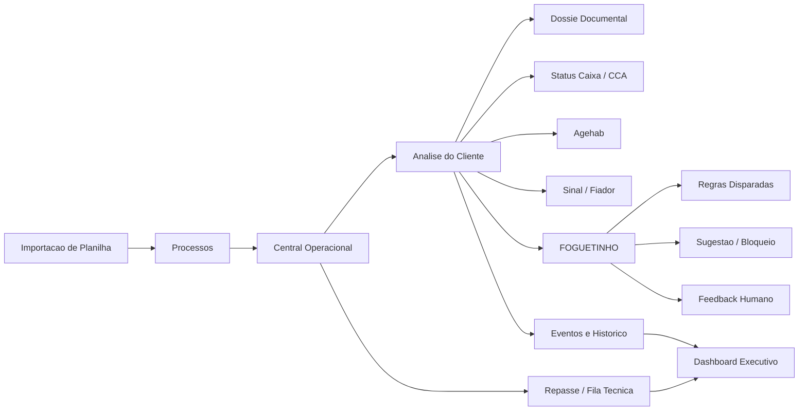
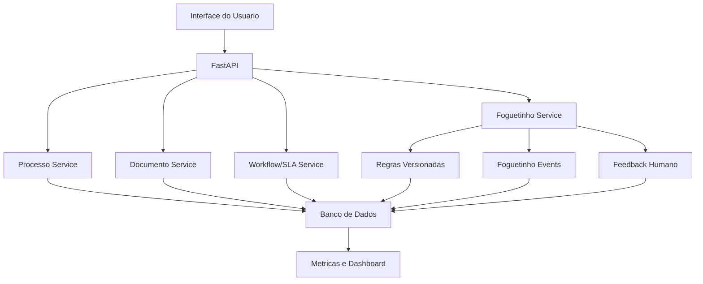

# Projeto de Execucao Final - MAQ2-Credito Corporativo

## 1. Nome do Projeto

**MAQ2-Credito**

Aplicativo corporativo para a rotina diaria do setor de credito, evoluido a partir da base historica SioCred, com FOGUETINHO como copiloto operacional supervisionado.

## 2. Objetivo Final

Construir a versao final do MAQ2-Credito mantendo a complexidade do negocio por tras das cortinas e entregando ao usuario uma experiencia simples:

1. O que esta acontecendo?
2. O que esta travando?
3. O que eu faco agora?

O sistema deve continuar profundo:

- regras completas;
- status internos;
- historico;
- auditoria;
- SLA;
- eventos;
- workflow;
- Foguetinho;
- feedback humano.

Mas a tela deve mostrar apenas o que ajuda o usuario a decidir e agir.

## 3. Principios de Execucao

1. Nao apagar complexidade de negocio.
2. Nao expor complexidade tecnica para o usuario.
3. Nao refazer tudo de uma vez.
4. Nao quebrar rotas legadas antes de paridade.
5. Nao dar autonomia forte ao Foguetinho sem auditoria.
6. Nao migrar regra escondida sem mapear origem.
7. Implementar em pacotes pequenos, testaveis e reversiveis.

## 4. Desenho Macro do Produto



## 5. Arquitetura Alvo por Tras das Cortinas



Observacao:

- A arquitetura pode ser criada aos poucos.
- O usuario nao ve `services`, regras em JSON, score tecnico ou tabelas.
- O usuario ve status, bloqueio, proxima acao e explicacao curta.

## 6. Mapa Final de Telas

Referencia detalhada:

- `docs/mapa_telas_perfis_maq2_credito.md`

### 6.1 Menu Final para Usuario

- Inicio
- Auxiliar Credito
- Analista Credito
- Corretor
- Gestor
- Diretoria
- Admin
- Foguetinho

### 6.2 Telas por Perfil

| Perfil | Telas principais | O que precisa ver |
| --- | --- | --- |
| Auxiliar Credito | Inicio, Fila Auxiliar, Conferencia Documental, Pendencias, Importacao | O que conferir, corrigir, organizar ou encaminhar |
| Analista Credito | Inicio, Central de Credito, Analise do Cliente, Dossie, Repasse Tecnico, Foguetinho | O que decidir, o que bloqueia, qual regra disparou e qual proxima acao |
| Corretor | Inicio, Pre-cadastro, Meus Clientes, Pendencias Solicitadas, Apresentacao | O que cadastrar, acompanhar ou responder sem acessar operacao interna |
| Gestor | Inicio, Dashboard Gestor, Central Operacional, Produtividade, Gargalos, Qualidade | Gargalos, SLA, retrabalho, produtividade e processos em risco |
| Diretoria | Inicio Executivo, Dashboard Diretoria, Carteira, Riscos, Performance, Relatorios | Indicadores consolidados, risco macro e tendencia da carteira |
| Admin | Inicio Admin, Usuarios, Permissoes, Auditoria, Integracoes, Regras do Foguetinho, Logs | Usuarios, regras, seguranca, integracoes e saude do sistema |

## 7. Desenho das Telas

### 7.1 Inicio

Objetivo:

Mostrar o que precisa de atencao no dia.

```text
+------------------------------------------------------+
| MAQ2-Credito                    Perfil / Sair        |
+------------------------------------------------------+
| Hoje                                                 |
| [Pendencias novas] [Em risco] [Prontos] [SLA]        |
+------------------------------------------------------+
| Prioridade do Foguetinho                             |
| - Cliente A: bloqueado por Agehab                    |
| - Cliente B: falta motivo da pendencia               |
| - Cliente C: pronto para repasse                     |
+------------------------------------------------------+
| Atalhos: Central | Importacao | Repasse | Gestor     |
+------------------------------------------------------+
```

O usuario nao ve:

- regra interna;
- score tecnico;
- JSON;
- tabela.

### 7.2 Central Operacional

Objetivo:

Ser a tela de trabalho diaria.

```text
+------------------------------------------------------+
| Central Operacional                                  |
| Filtros: Periodo | Etapa | Obra | Corretor | Status  |
+------------------------------------------------------+
| Abas: Agora | Comercial | Credito | Docs | Repasse   |
+------------------------------------------------------+
| Lista de processos                                   |
| Cliente | Etapa | Dono | SLA | Bloqueio | Acao       |
| Ana     | Cred  | Ana. | 4h  | Docs     | Abrir      |
| Joao    | Rep   | CCA  | 2h  | Agehab   | Abrir      |
+------------------------------------------------------+
| Painel lateral: resumo de gargalos                   |
+------------------------------------------------------+
```

Complexidade por tras:

- prioridade;
- SLA;
- dono atual;
- regras disparadas;
- classificacao de risco.

### 7.3 Analise do Cliente

Objetivo:

Concentrar decisao operacional.

```text
+----------------------------------------------------------------+
| Cliente: Maria Silva                  Status: Atencao           |
+-------------------------+----------------------+---------------+
| Dados do Processo       | Documentos           | FOGUETINHO    |
| Obra                    | Pendente/Aprovado    | Bloqueio      |
| Corretor                | Motivo pendencia     | Motivo        |
| Estagio                 | Secoes do dossie     | Proxima acao  |
| Renda / Valor           |                      | Feedback      |
+-------------------------+----------------------+---------------+
| Caixa / CCA | Agehab | Sinal | Fiador | Observacao             |
+----------------------------------------------------------------+
| [Salvar] [Gerar retorno] [Enviar para proxima etapa]            |
+----------------------------------------------------------------+
```

FOGUETINHO deve mostrar:

- status geral;
- regra disparada;
- motivo;
- acao sugerida;
- se bloqueia ou alerta;
- feedback: concordo, discordo, faltou regra, resolvido.

### 7.4 Importacao

Objetivo:

Entrada limpa de dados por planilha.

```text
+------------------------------------------------------+
| Importacao                                           |
+------------------------------------------------------+
| 1 Upload -> 2 Preview -> 3 Validacao -> 4 Confirmar  |
+------------------------------------------------------+
| Erros por linha                                      |
| Linha | Cliente | Problema | Como resolver           |
+------------------------------------------------------+
| [Corrigir] [Importar lote]                           |
+------------------------------------------------------+
```

### 7.5 Repasse / Fila Tecnica

Objetivo:

Mostrar se o processo pode avancar para assinatura.

```text
+------------------------------------------------------+
| Repasse / Fila Tecnica                               |
| Filtros: CCA | Agehab | Sinal | Fiador | Obra        |
+------------------------------------------------------+
| Cliente | CCA | Agehab | Sinal | Fiador | Assinatura |
| Ana     | OK  | Pend.  | Pago  | N/T    | Bloqueada  |
+------------------------------------------------------+
| Bloqueios de assinatura                              |
+------------------------------------------------------+
```

### 7.6 Gestor

Objetivo:

Mostrar gargalos e produtividade sem entrar em detalhe tecnico.

```text
+------------------------------------------------------+
| Dashboard Executivo                                  |
+------------------------------------------------------+
| [Gargalos] [Retorno CCA] [Docs Pendentes] [SLA]      |
+------------------------------------------------------+
| Ranking de gargalos                                  |
| Documentos que mais travam                           |
| Corretores com mais retrabalho                       |
| Processos prontos para assinatura                    |
+------------------------------------------------------+
```

### 7.7 Admin / Regras do Foguetinho

Objetivo:

Uso restrito. Nao e tela diaria do analista.

```text
+------------------------------------------------------+
| Regras do Foguetinho                                 |
+------------------------------------------------------+
| Codigo | Categoria | Severidade | Ativa | Testar     |
+------------------------------------------------------+
| Simular regra em processos antigos                   |
| Ver impacto antes de ativar                          |
+------------------------------------------------------+
```

## 8. Frases de UX do Foguetinho

O Foguetinho deve falar linguagem operacional:

- "Bloqueado: falta motivo da pendencia."
- "Atencao: Agehab ainda nao validada."
- "Sugestao: pedir renda complementar."
- "Pode avancar: checklist visivel aprovado."
- "Perguntar se a unidade e retomada."
- "Assinatura travada: sinal ou fiador pendente."
- "CCA condicionado: registrar orientacao antes de seguir."

Nao usar na tela comum:

- `condicao_json`;
- `hit policy`;
- `model_registry`;
- `ProcessoFull`;
- `workflow_service`;
- `features`;
- `score_risco_regra` sem traducao.

## 9. Implementacao por Fases

### Fase 0 - Preparacao

Entregavel:

- Documento de matriz real de regras.
- Mapa final de telas.
- Lista de rotas que continuam, viram abas ou ficam ocultas.

Arquivos provaveis:

- `docs/matriz_regras_frankstein_execucao.md`
- `docs/mapa_telas_final_maq2_credito.md`

Criterio de aceite:

- Nenhuma regra importante fica sem classificacao.
- Nenhuma tela e removida sem destino definido.

### Fase 1 - Foguetinho Explicavel

Entregavel:

- Melhorar resposta do Foguetinho para trazer:
  - status;
  - regra;
  - motivo;
  - campo;
  - acao sugerida;
  - bloqueia ou alerta.

Arquivos provaveis:

- `frankstein_operacional.py`
- `app.py`
- `web/analista.html`
- testes em `tests/`

Criterio de aceite:

- Na tela de analise, o usuario entende por que esta bloqueado ou em atencao.
- O sistema nao depende de explicacao tecnica.

### Fase 2 - Feedback Humano

Entregavel:

- Botoes de feedback:
  - concordo;
  - discordo;
  - faltou regra;
  - regra exagerada;
  - resolvido.

Arquivos provaveis:

- `app.py`
- `web/analista.html`
- `bootstrap_runtime.py`
- tabela/evento de feedback se necessario.

Criterio de aceite:

- Cada feedback fica gravado com usuario, processo, regra e data.
- Feedback nao muda decisao automaticamente.

### Fase 3 - Central Operacional

Entregavel:

- Tela consolidada ou evolucao da tela atual para mostrar:
  - Agora;
  - Comercial;
  - Credito;
  - Documentos;
  - Repasse;
  - SLA.

Arquivos provaveis:

- `frontend-react/src/pages/AnalistaPainelPage.tsx`
- `frontend-react/src/App.css`
- endpoints existentes de processos e metricas.

Criterio de aceite:

- Usuario sabe o que fazer primeiro.
- Nao precisa abrir varias telas para enxergar gargalos.

### Fase 4 - Analise do Cliente com Painel Lateral

Entregavel:

- Reorganizar experiencia da analise do cliente:
  - dados;
  - documentos;
  - status;
  - Foguetinho lateral;
  - historico.

Arquivos provaveis:

- inicialmente `web/analista.html`;
- depois React quando houver paridade.

Criterio de aceite:

- Menos rolagem.
- Bloqueio e proxima acao aparecem sem procurar.

### Fase 5 - Regras Versionadas e Backtesting Simples

Entregavel:

- Matriz de regras vira base executavel aos poucos.
- Criar simulacao de regra em processos antigos.

Arquivos provaveis:

- novo `frankstein_rules_service.py`;
- possivel tabela `frankstein_rules`;
- `app.py`;
- testes.

Criterio de aceite:

- Regra nova pode ser testada antes de entrar em uso.
- Usuario comum nao ve a complexidade.

### Fase 6 - Migracao React com Paridade

Entregavel:

- Migrar as telas principais sem quebrar legado.

Ordem:

1. Gestor.
2. Central Operacional.
3. Analise do Cliente.
4. Repasse.
5. Admin/Regras.

Criterio de aceite:

- Tela React faz o mesmo que a tela antiga antes da antiga ser escondida.
- Existe rollback.

## 10. Primeiro Pacote de Execucao Recomendado

O primeiro pacote implementavel deve ser pequeno e seguro:

**Pacote 1 - Matriz de Regras + Foguetinho Explicavel**

Escopo:

1. Criar `docs/matriz_regras_frankstein_execucao.md`.
2. Listar regras atuais por categoria.
3. Marcar:
   - executa hoje;
   - documentada;
   - falta conectar;
   - tela afetada;
   - autonomia.
4. Ajustar o contrato do Foguetinho para expor melhor:
   - regra;
   - motivo;
   - campo;
   - acao sugerida.
5. Adicionar testes para as regras principais.

Por que comecar aqui:

- Evita retrabalho.
- Nao quebra tela.
- Nao exige migracao React.
- Prepara o cerebro do Foguetinho.
- Melhora imediatamente a confianca do usuario.

## 11. Checklist Antes de Codar

Antes de implementar, confirmar:

- Quais regras sao obrigatorias no dia a dia?
- Quais bloqueiam e quais apenas alertam?
- O corretor permanece sem acesso operacional?
- O checklist visual sera `Pendente`, `Aprovado`, `Nao aplica`?
- Quais status internos precisam continuar existindo?
- Quais telas devem sumir do menu, mas continuar acessiveis temporariamente?

## 12. Riscos e Protecoes

| Risco | Protecao |
| --- | --- |
| Quebrar regra existente | matriz antes de codar |
| Tela nova perder detalhe operacional | paridade antes de substituir |
| Foguetinho decidir demais | autonomia por niveis |
| Usuario ver complexidade tecnica | linguagem operacional |
| Refatoracao grande travar projeto | pacotes pequenos |
| React apagar regra em HTML legado | migracao incremental |

## 13. Definicao de Pronto

Uma entrega so esta pronta quando:

- usuario entende o que fazer;
- regra disparada fica explicada;
- evento/feedback fica registrado quando necessario;
- testes passam;
- tela antiga ainda tem caminho de volta se a nova falhar;
- nao aumenta clique desnecessario;
- nao expoe complexidade tecnica para usuario comum.

## 14. Direcao Final

Construir o MAQ2-Credito como uma ferramenta operacional inteligente:

- forte por dentro;
- simples por fora;
- fiel ao setor de credito;
- guiada pelo Foguetinho;
- supervisionada pelo usuario;
- evolutiva sem retrabalho.
